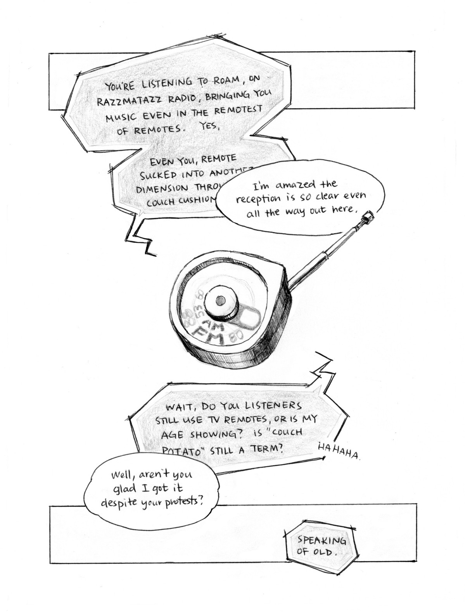

## background
*razzmatazz* is a slice-of-life narrative in a world where plant-powered transportation is just another part of life. I explore a possible symbiotic relationship between people, plants, and transportation, drawing on research on bio-photovoltaic batteries and plant reactions to sound and music.

The comic was written for an art anthology zine, the prompt being *cyber-genre* — cyberpunk mixed with an unusual genre of choice. Taking the sci-fi and grassroots (get-it?) aspects of cyberpunk, I combined them with lots of plants, retro tech, and a calming travelogue perspective. Cute old ladies are often not featured in cyberpunk stories, so I gave them a place in mine.

---

<MdxImage>

  

</MdxImage>

Some caption...