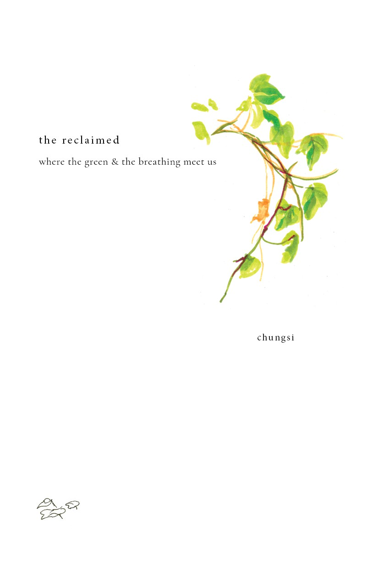

<!-- imports from jsx can go here -->

## Background

*reclaimed* is a series of watercolour paintings exploring the perceived boundary between the *natural* and the *man-made.* In modern society, there is a popular view of a separation between the untouched wilds and the civilized, developed society; sometimes, the views goes so far as to posit that everything man does is harmful to the natural ecosystems.

Yet, humanity and Earth is inextricably linked. Perhaps the green world is not as fragile and unforgiving as we believe it to be. Perhaps the very belief that a boundary exists is a.

The series of paintings depicts abandoned, delipidated, and sometimes forgotten built structures being reclaimed by our green neighbours. What was deemed as lifeless and useless for society is instead teeming with life and purpose by another definition. The clear boundary that once existed between the *wild* and the *built* is blurred, gently filled, and quietly inhabited.

Could this space be something we design *for*, not *against*?

Words were added at a later date to accompany the pieces in a printed format.

---

<MdxImage
  style={'landscape cover'}
  caption='1/24'>

  

</MdxImage>

## the reclaimed
where the green & the breathing meet us

<MdxImage
  style={'landscape'}
  caption='2-3/24'>

  

</MdxImage>

<MdxImage
  style={'landscape'}
  caption='4-5/24'>

  

</MdxImage>

we walk this place  
our feet planted to the earth  
our hearts grown from the soil  
our life nurtured through love&mdash;

so it is.

with the world as our playground  
we find fun with the forgotten  
and fill the abandoned with laughter,

we grow over our oldest ancestors  
and sprout up&mdash;pushed  
by a history on the fringes of memory.

so we are, as children,  
loved by the earth  
and beckoned by the green and the breathing

to this place  
 
reclaimed